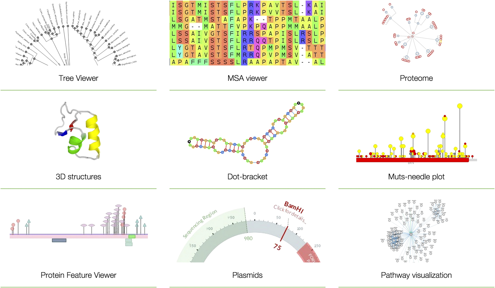

# biojs-visualization

Visualization component for BioJS, proposal for Google Summer of Code

## Introduction

Hendy Irawan - http://hendyirawan.com/

## Summary

_BioJS_ can visualize using this component.

## Details

Source: https://elifesciences.org/content/4/e07009

## Schedule

* Week 1 : Analysis
* Week 2 : Problem solving
* Week 3 : Develop
* Week 4 : Bug solving
 

